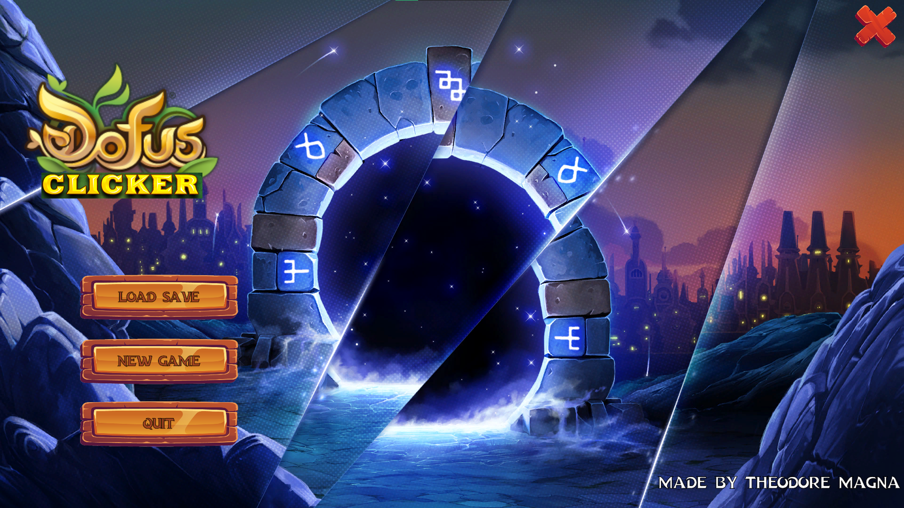
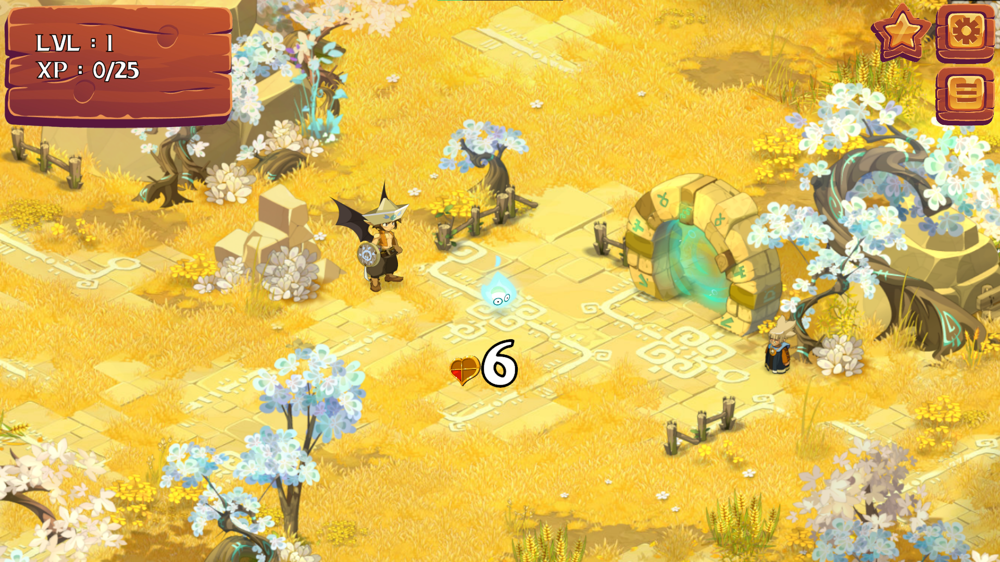

# DofusClicker
- **Contributors:**
  - [Théodore Magna](https://github.com/TheodoreEpitech)

## Description

This is a clicker game based on the MMORPG Dofus. The goal is to kill monsters to gain experience and level up. The game is written in C# and uses the Unity engine.

## Install
Not released yet

## Usage
Not released yet

## Screenshots

### Main menu

### First zone

### First boss

### Upgrades menu

### Achievements menu

### Some other areas

### And more to discover !
